## Laporan Praktikum Queue

### Jawaban Pertanyaan

#### 8.2.3 Jawaban

1. Karena itu mengindikasikan bahwa elemen front dan rear belum mempunyai di inputkan dan belum ada pada index atau data manapun. Karena seperti diketahui bahwa array selalu dimulai dari index 0, jika dimulai dari index 0 maka front & rear sudah memiliki elemen sedangkan pada kasus create front dan rear belum memiliki elemen.
2. Kondisi dimana data paling belakang dari queue berada di indeks terakhir array. Jadi jika damsukkan data baru, maka data tersebut akan menempati posisi indeks k-0 yang artinya posisi rear = 0.
3. Kode program
	
    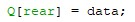

4. Kode program

    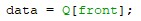
	 
5. Kondisi dimana data paling belakang dari queue berada di indeks terakhir array. Jadi jika dimasukkan data baru, maka data tersebut akan menempati posisi indeks ke-0 yang artinya posisi front = 0.
6. Karena data yang tersimpan tidak pasti dalam indeks 0.
7. Untuk mencegah print melebihi indeks max elemen pada kode program.

#### 8.3.3 Jawaban

1. Untuk mencegah print melebihi indeks max elemen pada code program.
2. Error, karena pada class penumpang objek tersebut memiliki parameter, sehingga perlu diisikan nilai pada tanda () tersebut.
3. Kode program	 

    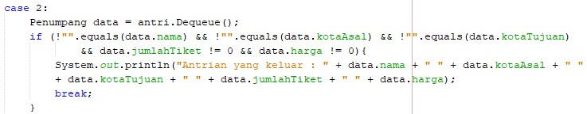

4. Kode program Class Penumpang
    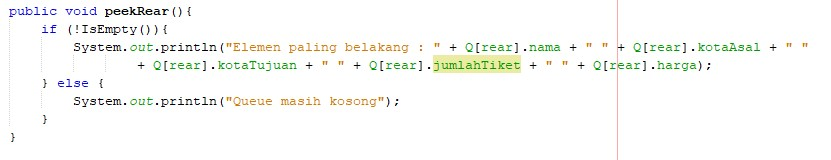
 
    Main class (QueueMain)
    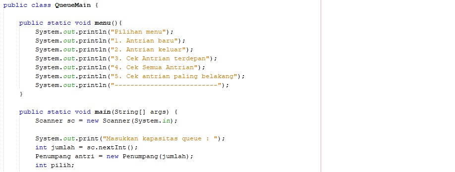

    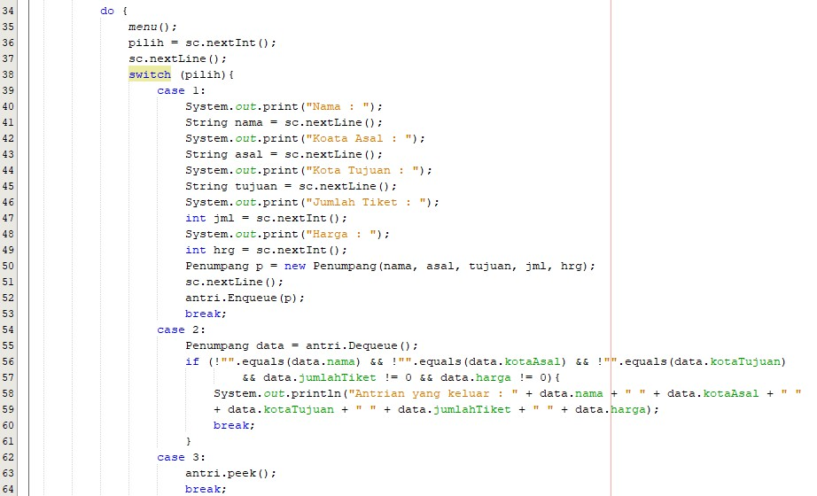

    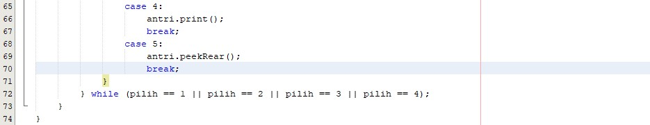
 
    output

    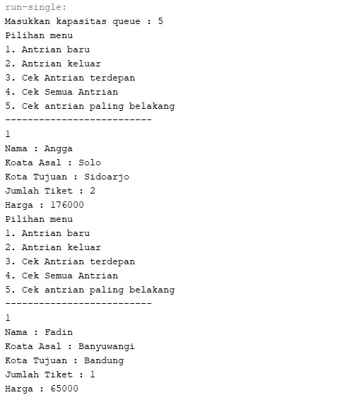

    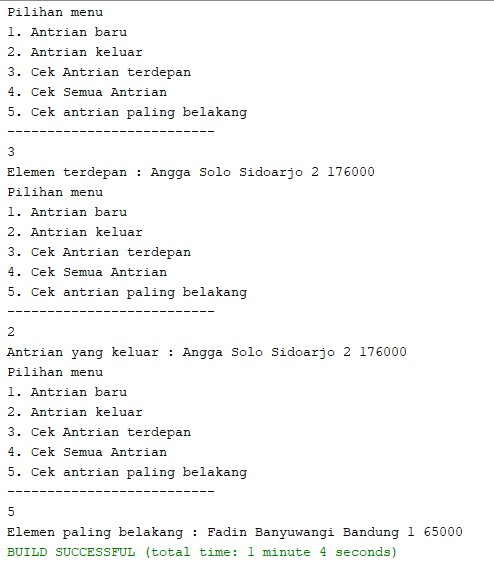

## Output Latihan Tugas

### Soal 1

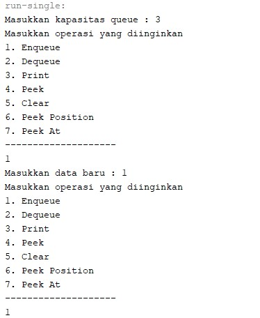

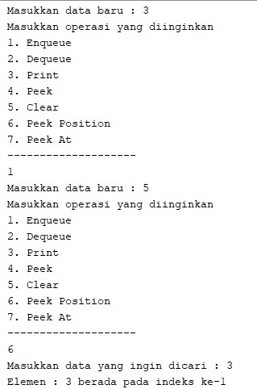

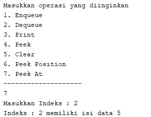
 
 
### Soal 2

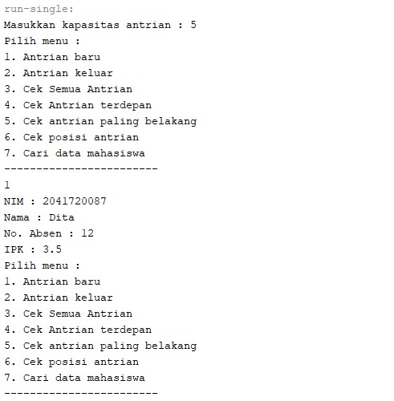

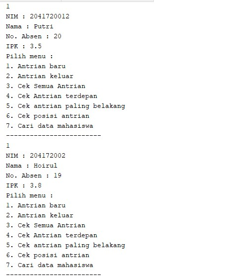

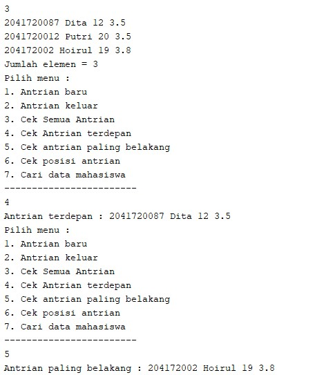

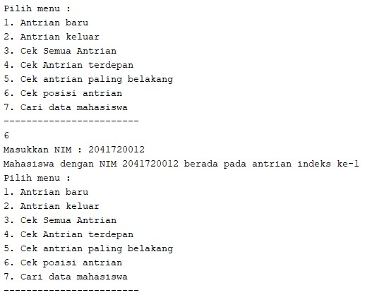

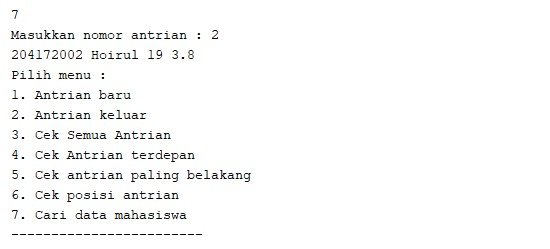
 
 
 
 
 

