## Laporan Praktikum Linked List

### Jawab Pertanyaan

#### 9.2.3 Jawaban

1.	Karena pada SLLMain tidak ada pemanggilan method untuk menambahkan data 
2.	Potongan kode program berikut terdapat pada method insertAfter. Temp sama dengan head, apabila data head sama dengan key, maka data yang akan di inputkan akan next sama dengan temp.next. Temp.next tersebut akan diisikan data yang diinputkan. Jadi berfungsi untuk menginsert data pada setelah temp 
3.	Untuk melakukan pengecekan jika data setelah temp.next adalah null maka temp.next berada 
pada index terakhir 

#### 9.3.3 Jawaban

1.	Agar tidak menghapus key yang dimasukkan, jika tidak ada break maka semua data akan terhapus 
2.	Data akan next atau ke node selanjutnya apabila data yang dihapus sudah terpenuhi 
3.	Apabila temp == null atau kosong, maka indeks berada pada posisi -1. Jika tidak null atau kosong maka indeks berada pada posisi varible index 

## Output Tugas Praktikum

### Soal 1

Kode program
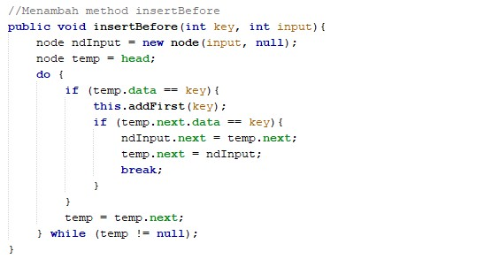

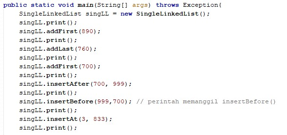

Output

### Soal 2

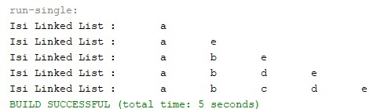

### Soal 3

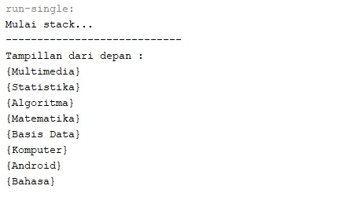

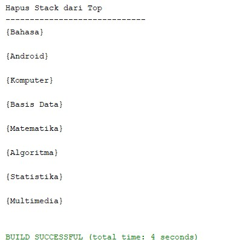

### Soal 4

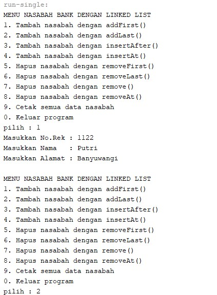

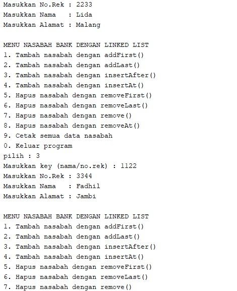

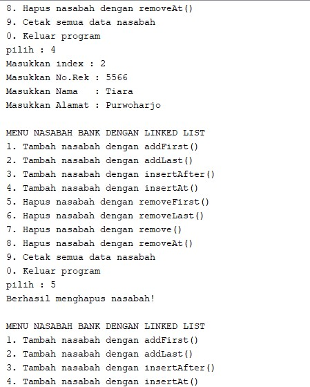

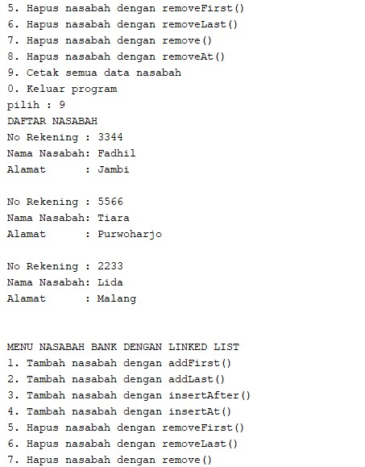

### Soal 5

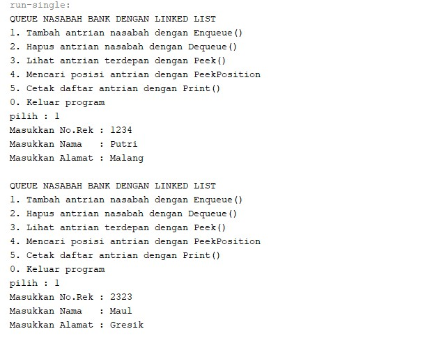

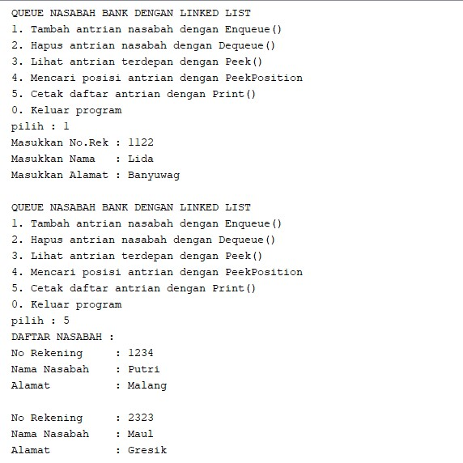

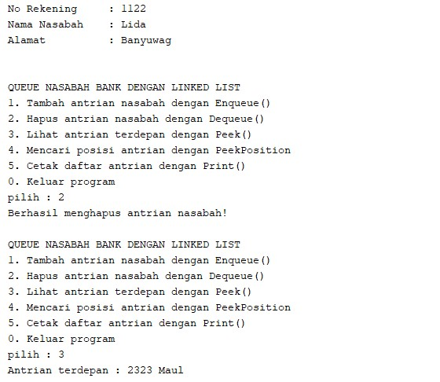

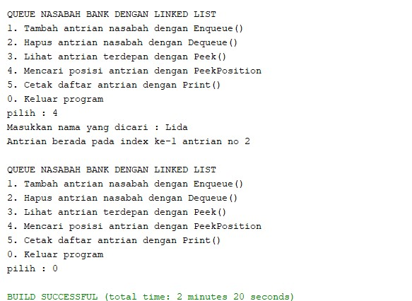

