## Laporan Praktikum Double Linked Lists

### Jawaban Pertanyaan

#### 12.2.3 Jawaban
1. Dalam single linked list hanya dapat melangkah maju ke data selanjutnya namun tidak bisa kembali ke data yang sebelumnya karena tidak ada node yang digunakan untuk mundur ke data tersebut. Biasanya item/barang yang terdaftar terkoneksi melalui pointer dimana diketahui sebagai link dan dikurung disebut sebagai linked list. Satu list element link ke element selanjutnya melewati pointer. Single linked list hanya memiliki kead yang merupakan kepala/awal dari suatu rangkaian data dan digunakan untuk awalan lintasan maju.
Contoh : HEAD  data1  data2  data3  NULL
Double linked list dimana kita tidak hanya menyimpan node selanjutnya, tetapi kita juga menyimpan node sebelumnya didalam struktur node dan hasilnya itu dapat dipindahkan maju dan mundur didalam list. Lebih fleksibelitas dari pada single linked list dengan memiliki keduanya dari sebelumnya dan pointer selanjutnya.
Contoh : HEAD ⇄ data1 ⇄ data2 ⇄ data3 ⇄ TAIL note: head  prev = NULL; TAIL  next = NULL;

2. Pointer next menunjukkan pada node setelahnya atau berikutnya sedangkan pointer prev menjunjukkan pada node sebelumnya.

3. Sebagai inisialisasi yang menandakan bahwa atribut head tersebut masih kosong.

4. Karena dianggap belum ada isinya dan kondisi prev menunjuk ke null atau tidak menunjuk kemanpun.

5. Menujukkan bahwa pointer prev pada head menuju ke new node bahwa sudah terisi data pada node sebelumnya adalah sebagai node baru.

6. New node yang baru prev akan menunjuk ke current/data yang sudah ada dan next menunjuk ke null.

#### 12.3.3 Jawaban

1. Posisi head saat itu berada pada node berikutnya dan pointer prev pada head menunjuk ke null.

2. Cara mendeteksi posisi data ada pada bagian akhir pada method removeLast() adalah Ketika nilai current sudah sama dengan kososng atau null maka current tersebut di remove dan current null akan di decrement.

3. Karena tidak jelas pointernya menunjuk kemana sehingga tidak cocok untuk perintah remove.

4. Kode program tersebut berfungsi untuk mengganti penunjukkan ponter next dan juga mengganti penunjukkan pointer prev.

#### 12.4.3 Jawaban 

1. Jumlah data yang ada di dalam linked list akan diperbarui secara otomatis, Oleh karena itu dibuatlah sebuah method size() untuk mendapatkan nilai dari size.

2. Ketika ingin mengatur indeks pada double linked list agar dapat dimulain dari indeks ke-1, maka kita harus mengganti inisialisasi dari variabel i yang semula 0 menjadi 1 Variabel i tersebut terletak pafa method get() di class DoubleLinkedLists.
Kode yang semula seperti gambar berikut :

    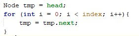
 
    Menjadi

    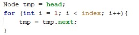
 
3. Pada SLL fungsi add kita hanya memperhatikan letak datanya, dan data next. Pada DLL fungsi add lebih kompleks dimana harus memperhatikan nilai next, current dan prev dari data. 
4. a.) ketika menjalankan method isEmpty() maka akan dicek size dan linked list, jika sizenya bernilai 0, maka akan di return true, sedangkan jika salah maka akan direturn false.
b.) Ketika akan menjalankan method isEmpty(), maka akan dicek dan direturn nilai dari head == null. Ketika head bernilai kosong (null) maka akan direturn true, namun ketika tidak (head tidak kosong/null) maka akan di return false.

## Output Tugas Praktikum

### Soal 1

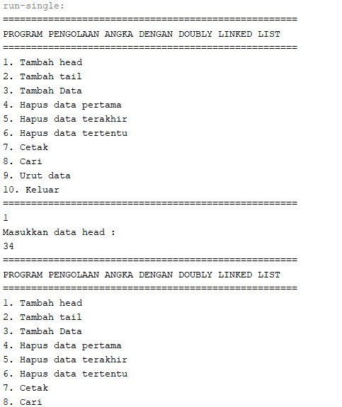

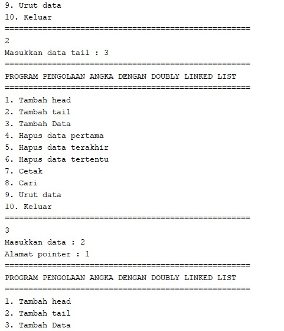

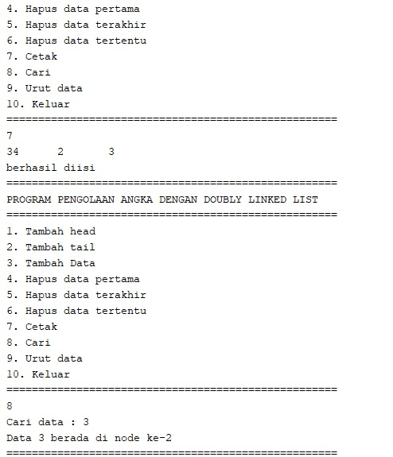

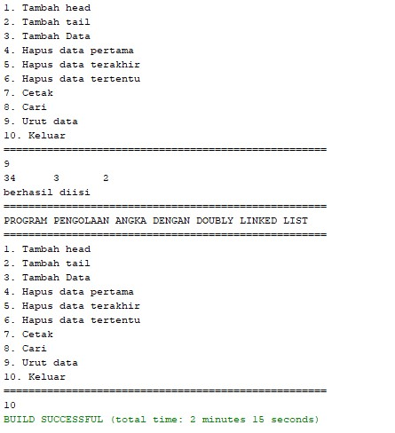

### Soal 2

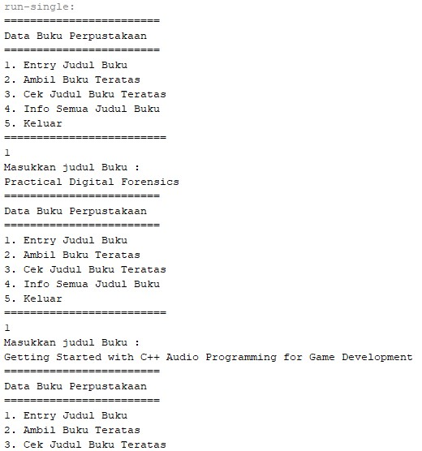

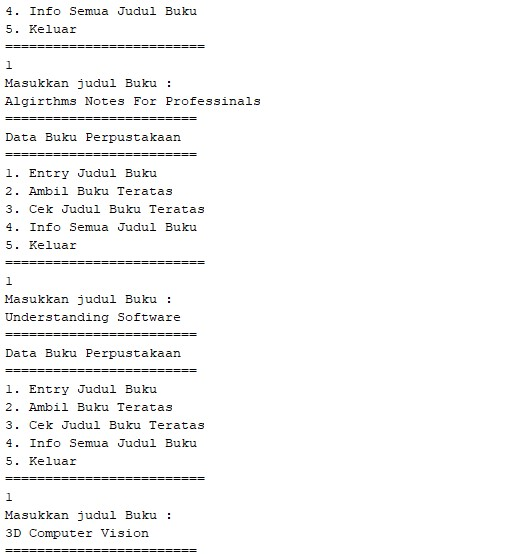

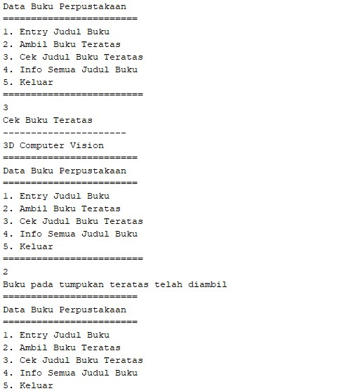

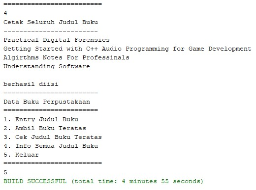

### Soal 3

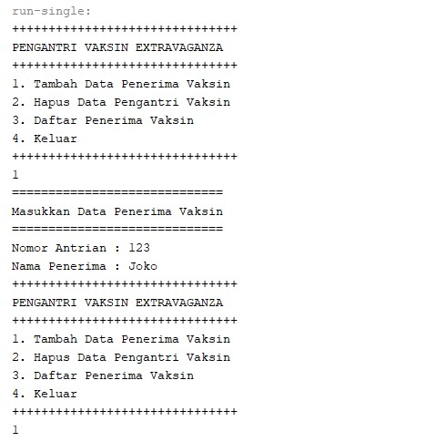

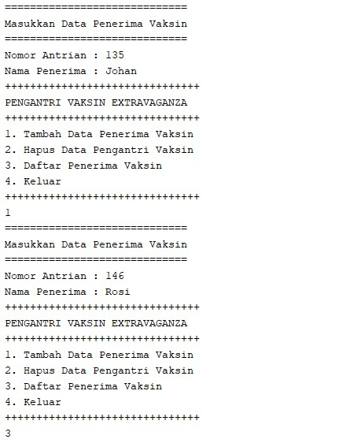

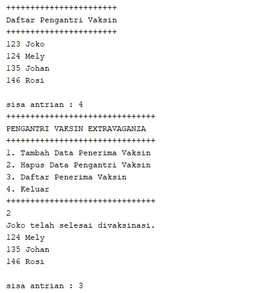

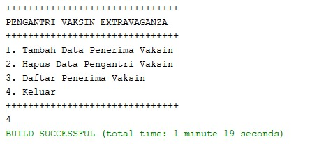

### Soal 4

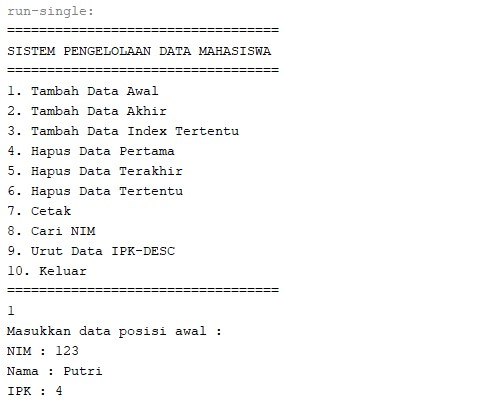

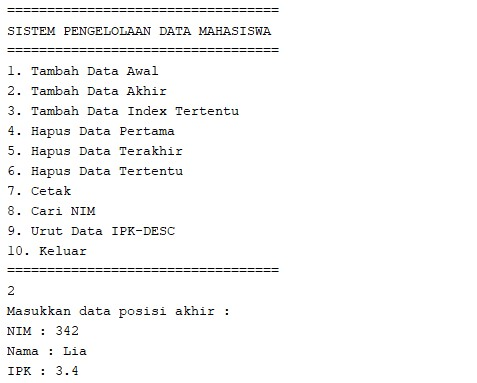

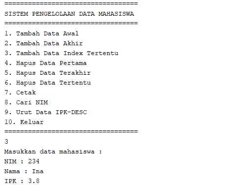

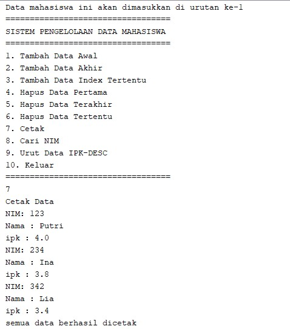

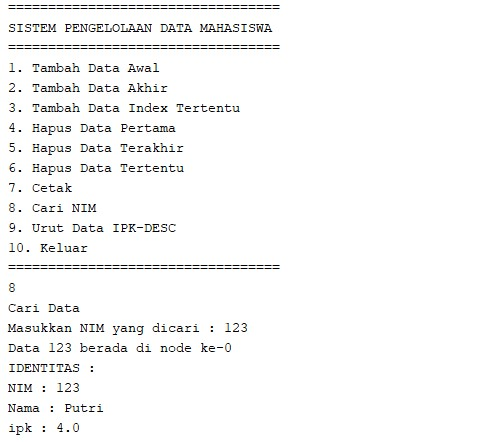

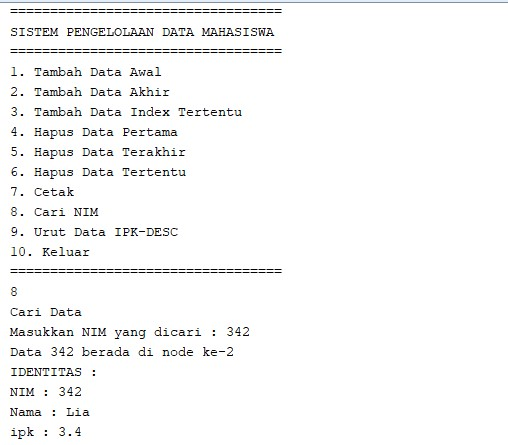

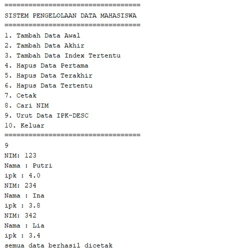

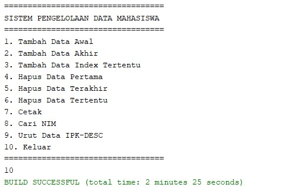