# Laporan Praktikum Array of Object

## Jawaban Soal

### Jawaban 3.2.3
1.	Tidak, karena atribut berfungsi untuk menyimpan suatu nilai yang dapat berubah sedangkan method adalah program yang mengimplementasikan action sehingga class wajib mempunyai atribut sebagai penampung nilai namun tidak harus memiliki method.
2.	Iya menggunakan konstruktor.
3.	Untuk membuat instansiasi array of objeck.
4.	Untuk membuat array persegipanjang yang didalamnya memiliki 3 elemen
5.	Karena, supaya konsep dari class yang telah ditentukan itu jelas, tidak rancu, dan saling terhubung.

### Jawaban 3.3.3
1.	Bisa. Jadi, ada kolom dan baris yang nama kolom dan baris itu merupakan indeksnya.
2.	Kodingan :

    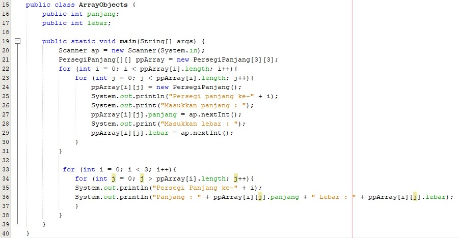
 
3.	Karena pgArray ke-5 tidak terdapat instansiasi object persegi.
4.	Kodingan :

    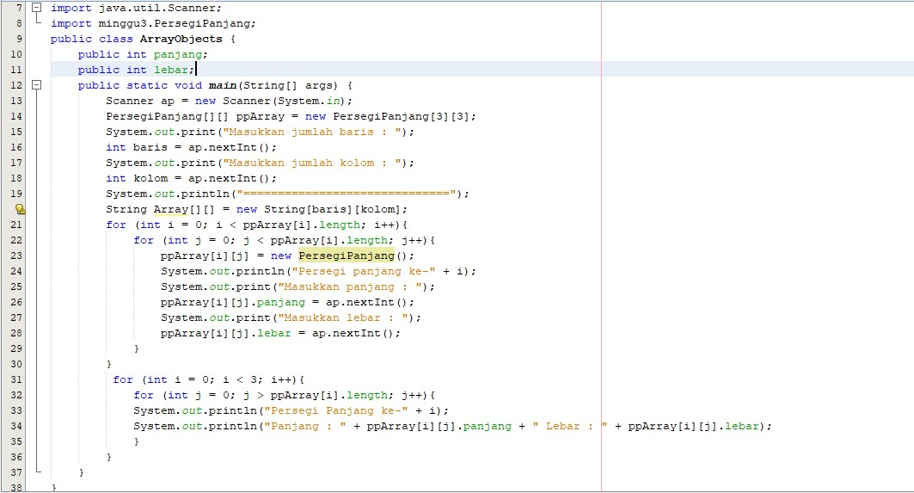
 
5.	Boleh, tetapi output nya akan sama karena tidak berpengaruh dengan program.

### Jawaban 3.4.3 
1.	Boleh, asalkan parameternya berbeda-beda. Contohnya yaitu seperti : 

    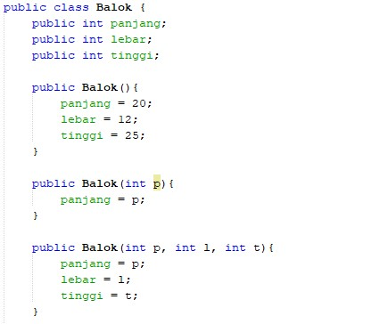
 
2.	Kodingan 
 
    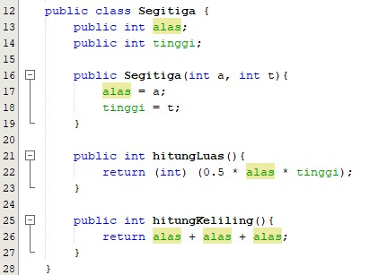

    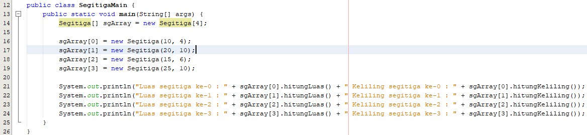

### Output Latihan Praktikum

1. 	Output

    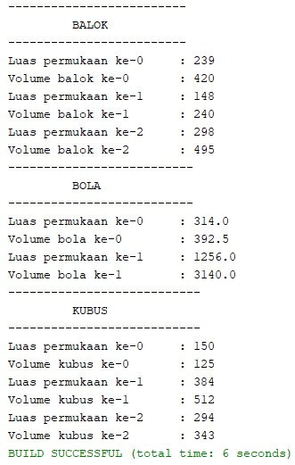
 
2.	Output

    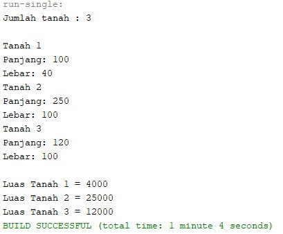
 
3.	Output

    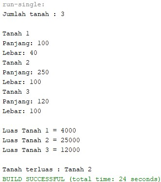
 
4.	Output

    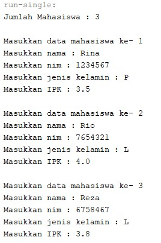 
    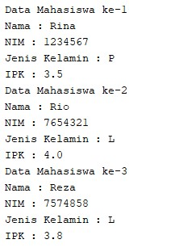

5. Output

    
    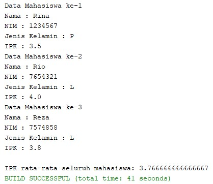
 
 
 

