## Laporan Praktikum Brute Force dan Divide Conquer

### Jawaban Soal

#### Jawaban 4.2.3

1. Dari variabel nilai dibawa ke parameter method factorialDC. Disitulah dicek, apakah nilai n = 1 atau tidak. Jika nilai = 1, maka akan mereturn 1 atau dikalikan 1, namun apabila n tidak sama dengan 1, misalnya seperti angka 5 diatas, maka akan mereturnn*faktorialDC(n-1) Berikut penjelasan alur lengkapnya mengenai return yang kedua tersebut :

    a = (5*faktorialDC(4))

    b = (4*faktorialDC(3))

    c = (3*faktorialDC(2))

    d = (2*faktorialDC(1))

    e = return 1

    Sehingga dari penguraian tersebut dapat ditemukan bahwa nilai factorial akan muncul dari perhitungan 5 * 4 * 3 * 2 * 1 = 120

2.  a. Divide : Membagi masalah menjadi beberapa upa-masalah yang memiliki kemiripan
dengan masalah semula namun berukuran lebih kecil (idealnya berukuran hampir sama). Terletak pada kode program berikut :

    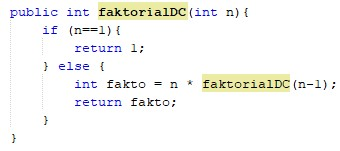

    b. Conquer = memecahkan nilai faktorial dalam fungsi rekursif

    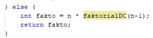

    c. Combine = menggabungkan keduanya sehingga menghasilkan jawaban jumlah faktorialnya 

3. Bisa, contohnya saja menggunakan while. Dengan cuplikan kode program berikut :

    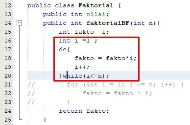

4. Berikut ini adalah tambahan waktu eksekusi dari kedua method :

    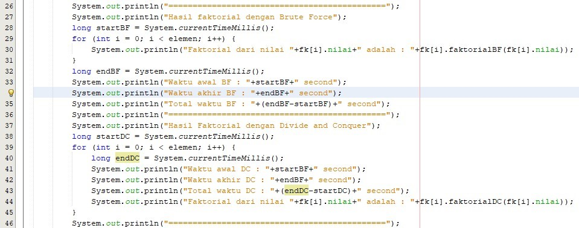

    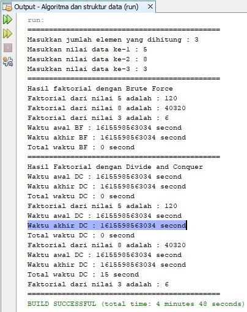

5. Dengan output dari input 25 sebagai berikut : 

    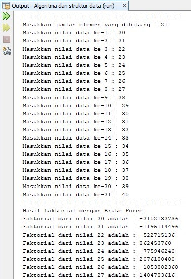

    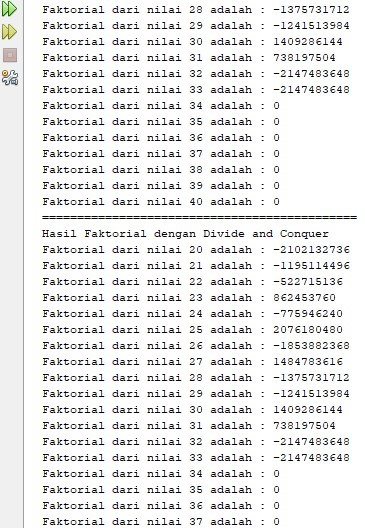

    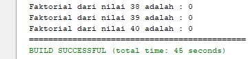

    Dan tentu saja waktu eksekusi program akan berbeda, karena metode yag digunakan untuk meghitung pangkat juga berbeda.

#### Jawaban 4.3.3 

1. Perbedaan keduanya terletak pada alurnya. Jika pada method pangkatBF() bilangan yang dipangkatkan dikalikan dengan bilangan itu sendiri sebanyak jumlah pangkatnya menggunakan perulangan, maka jika pada method pangkatDC() maka akan terdapat 3 tahapan. Yang pertama adalah divide yaitu membagi masalah menjadi upa masalah, lalu dilanjutkan dengan conquer yaitu menyelesaikan masing-masing upa masalah, llau tahap ketiga adalah combine yaitu menggabungkan masing-masing solusi upa masalah

2. Maksudnya jika dioperasikan n%2==1 hasilnya berupa angka ganjil maka akan masuk ke if return sedangkan jika hasil dari penjumlahan if tidak terpenuhi maka akan masuk kedalam else 

3. Sudah, yaitu pada potongan kode program di bawah ini :
    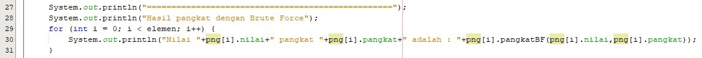

4. Kode program

    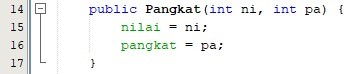

5. . Agar salah satu method yang ditampilkan, berikut merupakan kode program tambahan : 

    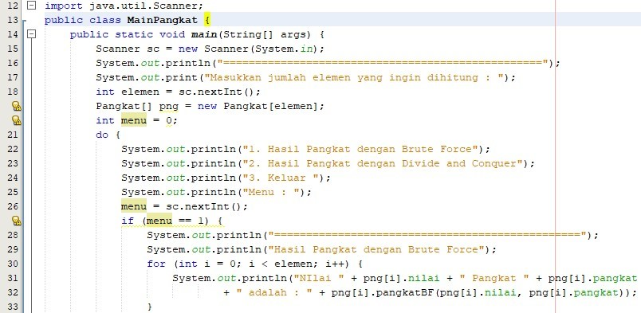

    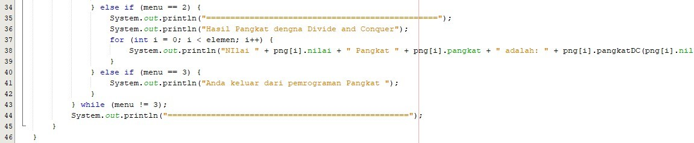

#### Jawaban 4.4.3  
 
1.	Dengan method TotalBF() = setiap elemen senarai dibandingkan dengan arr. Pencarian selesai jika arr ditemukan atau elemen senari sudah habis diperiksa 
Dengan method TotalDC() = lebih natural diungkapkan dengan skema rekrusif 
2.	Bisa menggunakan DecimalFormat 
3.	Dapat mengembalikan / melaporkan nilai (return value) 
4.	Karena untuk menghitung angka atau memasukkan rumus yang akan di hitung di dalam lsum, rsum, dan sebagainya 
5. Berikut ini merupakan kode program modifikasi :

    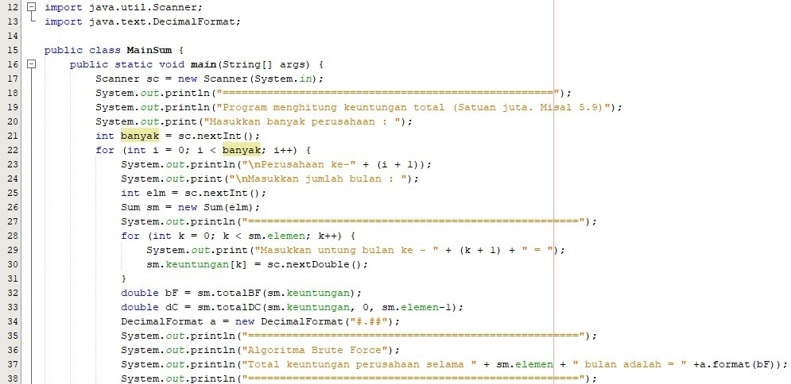

    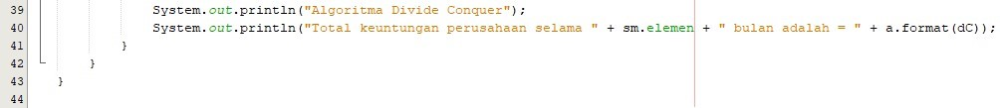

    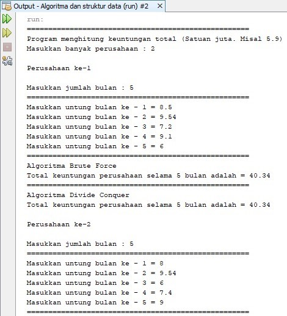

    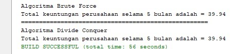

## Output Tugas Praktikum

1. Output

    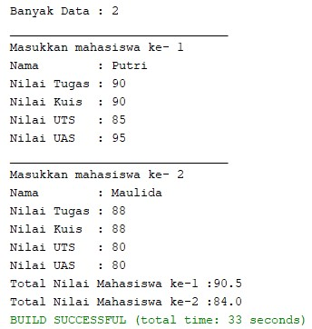

2. Output

    

3. Output

    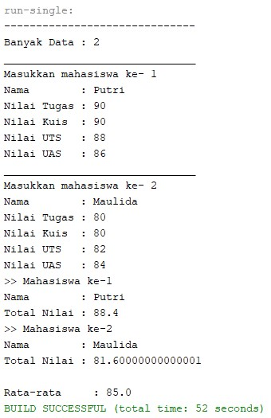

4. Output

    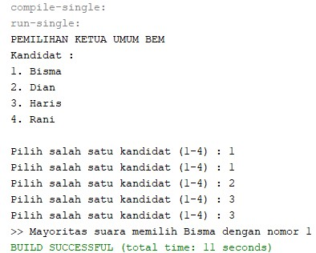

    

