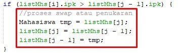
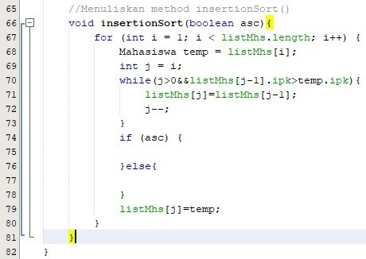
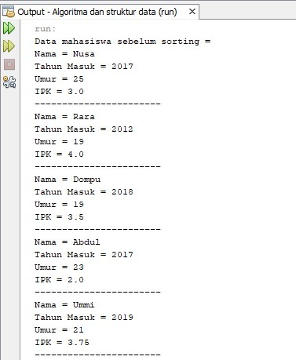
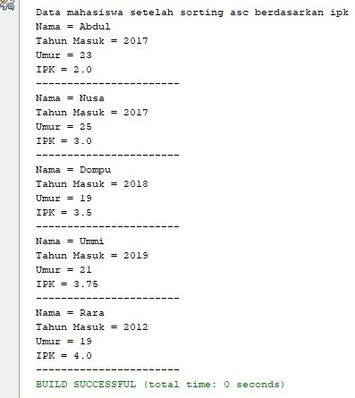

## Laporan Praktikum Data Sorting (Bubble, Selection, dan Insertion Sort) 

### Jawaban Soal 

#### Jawaban 5.2.3 
1.	Untuk proses bubble sort terdapat di method void bubbleSort()
2.	Untuk proses selection sort terdapat di method void selectionSort() 
3.	Proses swap merupakan pertukaran indeks objek untuk mengurutkan inndeks objek tersebut, berikut potongan program untuk proses swap
    
4.	Untuk melakukan proses pernukaran nilai selama kondisinya terpenuhi
5.  a.	Di perulangan i untuk menghitung index, apakah index i lebih kecil daripada index j dan di perulangan j untuk menghitung index, bila mana index j lebih kecil dari pada index i.

    b.  Karena agar jumlah pertukaran bilangannya sama dengan banyaknya bilangan

    c.	Karena agar perulangan akan diulang sebanyak panjang bilangan (sampai i<listMhs.length-1) dimana perulangan ini untuk melakukan pertukaran nilai apabila kondisinya sudah terpenuhi.

    d.	Perulangan i akan berlangsung selama 49 kali. Dan tahap buble sort akan menempuh selama 1225 kali.

#### Jawaban 5.2.3

1.	Pada perulangan ini akan memilih nilai terkecil (atau elemen dengan nilai terkecil diantara seluruh elemen yang tersisa) dan kemudian menukarnya dengan elemen kedua. Algoritma akan terus berlanjut sampai perulangan terakhir memilih elemen dengan nilai terbesar kedua, kemudian menukarnya dengan index terakhir kedua, sehingga meninggalkan elemen terbesar di index terakhir. Setelah perulangan ke-i, maka elemen i terkecil dari array akan diurutkan dengan urutan meningkat dalam elemen pertama i dari array

#### Jawaban 5.4.3
Kode Program

Output
    

