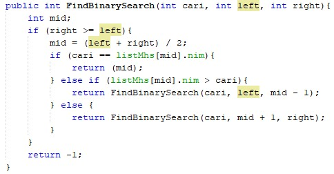

## Laporan Praktikum Searching

### Jawaban Soal

#### 6.2.3	Jawaban 

1.	Method TampilData untuk menampilkan data setelah data yang diinputkan, sedangkan TampilPossisi untuk menampilkan posisi index yang dicari, misal data yang diinputkan tidak ada di data maka output akan menghasilkan “tidak ditemukan”.
2.	Pencarian data yang menggunakan sequential searching akan berhenti bila kondisi sudah terpenuhi atau sudah ditemukan. Pada saat data array listMhs.dengan indeks[j] dengan atribut nim sama dengan data yg di cari dari parameter cari (input nim) maka variable posisi berisi j kemudian pencarian berhenti.
3.	Jika data NIM yang dimasukkan tidak terurut dari kecil ke besar, program masih dapat berjalan  dan hasil yang dikeluarkan benar. Karena di dalam pemanggilan FindBinarySearch terdapat pemilihan yang menentukan apabila suatu kondisi sudah memenuhi atau tidak.

6.2.3	Jawaban 

1. Kode program
    
    

2. Kode Program

    

3.	Jika data NIM yang dimasukkan tidak urut, program masih dapat berjalan tetapi output yang menggunakan binary search tidak ditemukan, dan output yang menggunakan sequential search hasilnya sesuai.
4.	Hasil dari binary search sebelum program di modifikasi input yang dicari hasilnya tidak ditemukan. Jadi, mengubah kode program binary search agar hasilnya sesuai
    
        

    output
    
     

    

     

5. Class
    
     

     

     

    

     

 

    