## Laporan Praktikum Stack

### Jawaban Pertanyaan

#### 7.2.3 Jawaban
1.	Fungsi angka 5 pada program adalah besarnya nilai parameter yang berfungsi menampung nilai untuk diproses di dalam fungsi dari array data.
2.	Kode program

      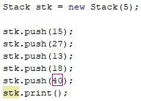

      Output

      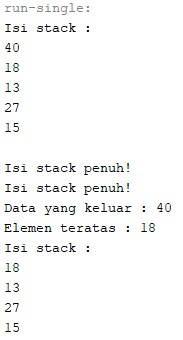

3.	Karena pada saat instansiasi objek stk parameternya bernilai 5, sehingga stack hanya dapat menampung 5 data saja dan pada stack tersebut sudah terisi penuh sehingga tidak dapat dimasukkan data lagi kedalam stack tersebut.  Cara kerjanya adalah saat menjalankan method push maka akan dilakukan pengecekan stack apakah sudah penuh dengan method IsFull(). Apabila method IsFull() bernilai false maka akan dilanjutkan pengisian data sedangkan apabila bernilai true maka akan memunculkan pernyataan. Apabila ingin angka 40 dapat ditampilkan maka mengubah nilai parameter objek stk menjadi 6.

#### 7.3.3 Jawaban
1.	Data yang tersimpan pada variabel bk  adalah judul, nama pengarang, tahun terbit, jumlah halaman, harga.
2.	Kode program

      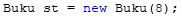

3.	Untuk menjalankan statemennya terlebih dahulu, kemudian baru memeriksa kondisi atau syaratnya. Perintah do-while() akan menjalankan statementnya sebanyak satu kali, meskipun syarat pengulangan tidak terpenuhi. Apabila syaratnya terpenuhi, maka do-while akan melanjutkan perulangan dan apabila belum terpenuhi maka akan berhenti/break.
4.	Kode program
   
      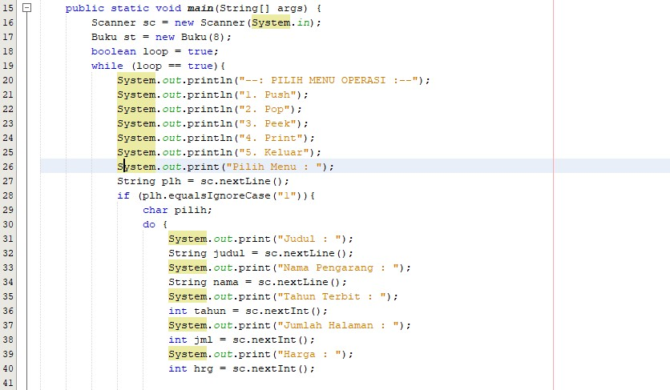

      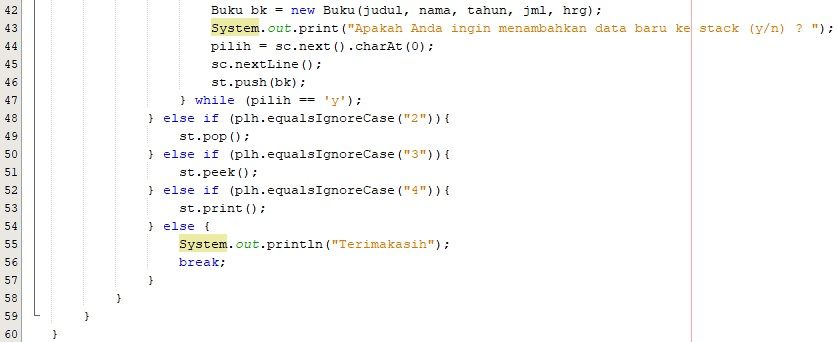

      Output
      
      1
      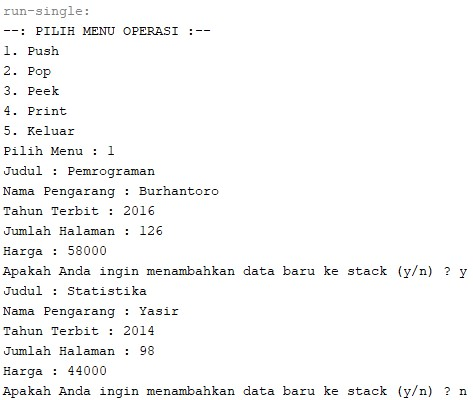

      2
      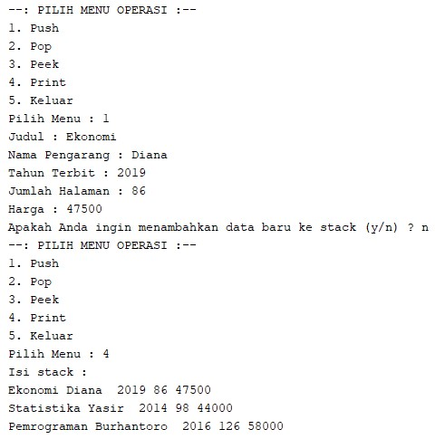

      3
      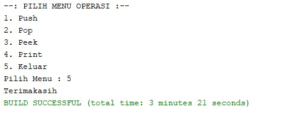

#### 7.4.3 Jawaban
1. Pada method derajat memiliki sebuah parameter c dengan tipe data char. Pada method tersebut terdapat program pemilihan menggunakan switch case. Pada case ‘^’ mengartikan bahwa merupakan derajat ke 3. Pada case ‘%’ ‘/’ ‘*’ merupakan derajat ke 2. Pada case ‘+’ ‘-‘ merupahan derajat ke 1. Apabila tidak terdapat operator dari case-case tersebut, maka tidak berderajat.
2. Variabel Q yang berupa tipe data String, sedangkan variabel c bertipe data char. Jadi c = Q.charAt(i); berfungsi bahwa pada penginputan Q yang berbentuk string sama dikonversikan sama dengan c yang bertipedata char. Dan maksud (i) tersebut akan mengulang sebuah proses tersebut mulai proses eksekusi data apakah operand atau operator.
3.  Output

      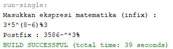

4. Karena tanda kurung bukan termasuk operator maupun operand.

### Output Tugas Praktikum

1. Output

   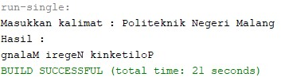

2. Output

   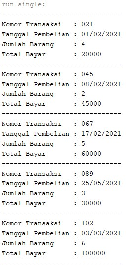

   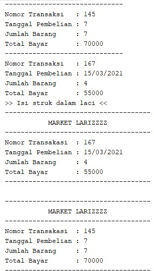

   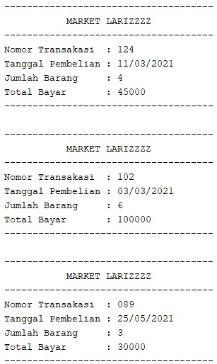

   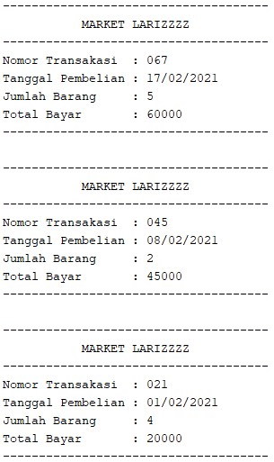

   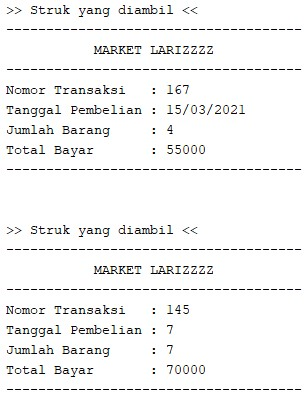

   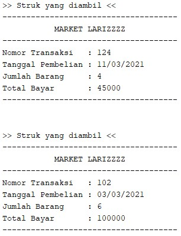

   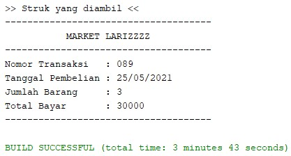
 
 
 
 
 
 
 
